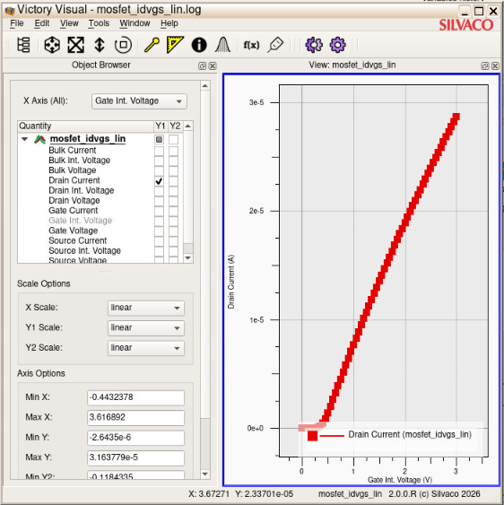
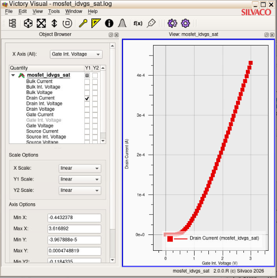
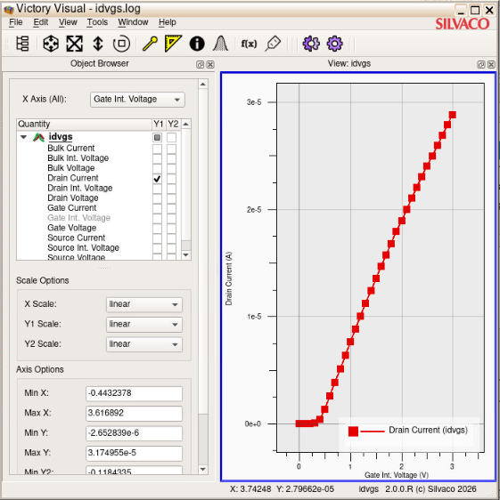
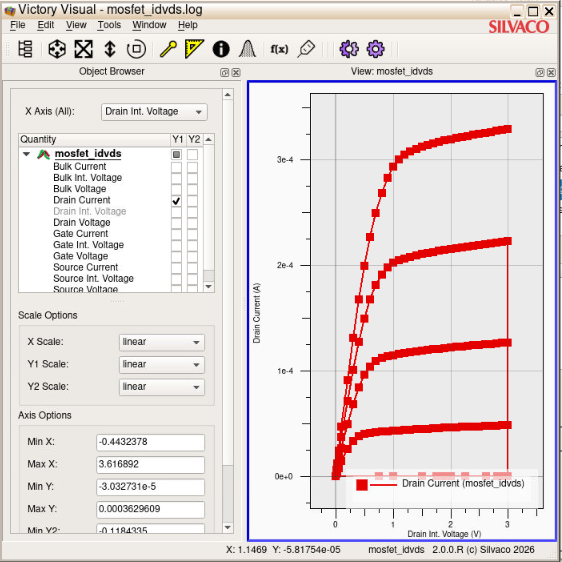
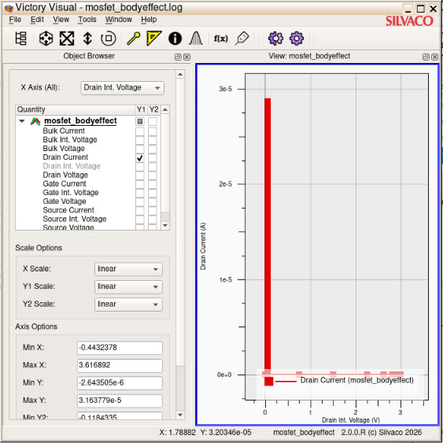

# MOSFET TCAD Simulation & SPICE Parameter Extraction

This repository contains a complete 2D numerical simulation of an N-channel MOSFET using **Silvaco Victory Device** (executed via nanoHub). The project automates the extraction of essential DC, saturation, and short-channel SPICE parameters using advanced syntax blocks directly from simulated electrical behavior.

## 📐 Simulated Device Physical Profile

Based on the DeckBuild mesh and region geometry, the simulated NMOS physical specifications are:
* **Gate Length ($L_g$):** $0.6\text{ }\mu\text{m}$ (Gate electrode spanning $x = 0.2$ to $x = 0.8$)
* **Gate Oxide Thickness ($T_{ox}$):** $100\text{ }\text{Å}$ ($0.01\text{ }\mu\text{m}$, from $y = 0.0$ to $y = 0.01$)
* **Substrate / Bulk Doping ($N_A$):** P-type, $1 \times 10^{17}\text{ cm}^{-3}$ (Uniform)
* **Source/Drain Doping ($N_D$):** N-type Gaussian profile, Peak $1 \times 10^{20}\text{ cm}^{-3}$ 

---

## 📊 Automated SPICE Parameter Extraction Results

The simulation executes targeted sweeps to extract key mathematical parameters used in SPICE models:

### 1. Linear Region Parameters ($V_{ds} = 0.05\text{ V}$)
* **`Vt_lin`**: Linear Threshold Voltage extracted via the maximum slope intercept method, adjusted for $V_{ds}/2$.
* **`gm_max`**: Maximum transconductance ($g_m = \frac{\partial I_d}{\partial V_{gs}}$).
* **`gm_over_Id`**: Sub-threshold efficiency index ($\frac{g_m}{I_d}$).

### 2. Saturation Region Parameters ($V_{ds} = 2.0\text{ V}$)
* **`Vt_sat`**: Saturation Threshold Voltage extracted via the $V_{gs}$ vs $\sqrt{I_d}$ intercept method.
* **`gm_max_sat`**: Peak transconductance under strong saturation conditions.

### 3. Channel & Output Parameters (Extracted at $V_{gs} = 2.5\text{ V}$)
* **`ro`**: Output Channel Resistance ($r_o = \frac{\partial V_{ds}}{\partial I_d}$) evaluated at peak bias conditions.
* **`lambda` ($\lambda$):** Channel Length Modulation parameter ($\lambda = \frac{1}{r_o \cdot I_{d,sat}}$) extracted from the maximum $I_d\text{-}V_{ds}$ swing.

### 4. Substrate Body Effect Parameters
* **`Vt_bs0`**: Base Threshold voltage at zero body bias ($V_{bs} = 0\text{ V}$).
* **`gamma_calc` ($\gamma$):** Body effect parameter calculated analytically using substrate parameters and gate oxide capacitance ($C_{ox} = 3.45\text{ fF/}\mu\text{m}^2$).

---

## 📈 Generated Characterization Plots

*Note: Visual outputs exported directly from Silvaco TonyPlot.*

### Transfer Characteristics ($I_d$ vs $V_{gs}$)
| Normal / Linear Scale | Saturation Region ($V_{ds} = 2.0\text{V}$) | Log Scale (Subthreshold) |
| :---: | :---: | :---: |
|  |  |  |

### Output Characteristics ($I_d$ vs $V_{ds}$)

### Body Effect Threshold Voltage Shift ($V_{bs}$ Modulation)

---

## 🛠️ Execution Instructions

1. Clone this repository to your local environment or workspace.
2. Upload the `simulation/mosfet_characterization.in` file to your **Silvaco DeckBuild** session inside nanoHub.
3. Click **Run**.
4. Upon successful completion, the runtime terminal output window will print the precise numeric values for all the custom `extract` parameters (`Vt_lin`, `lambda`, `ro`, etc.). 
5. Open any generated `.log` file inside **TonyPlot** to inspect the curves visually.
